# stockholm

Atlis mobile web app when you scan the qr code with you phones camera, you will be redirected to this app. (app.atlis.dev)

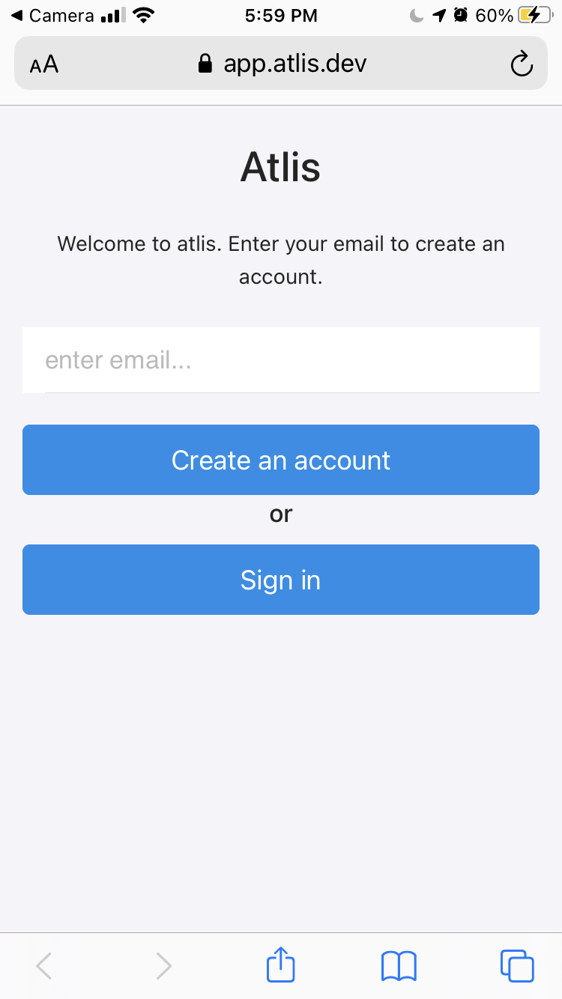
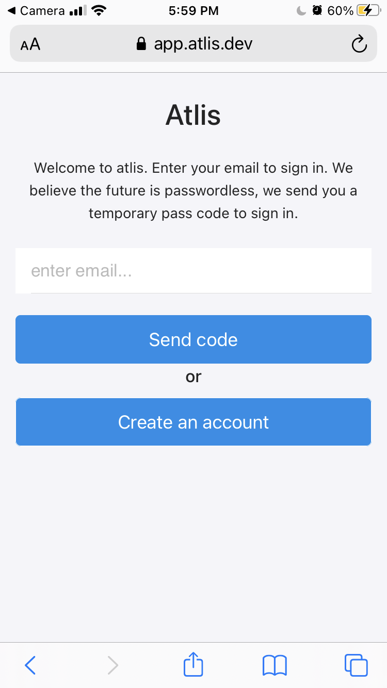

passcode sent to email
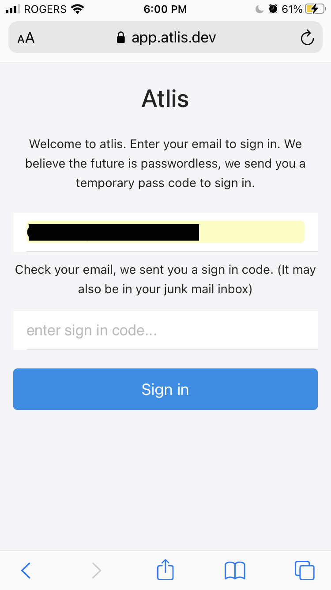

passcode email
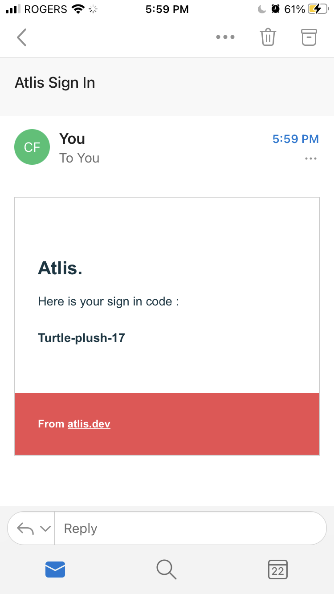

passcode entered
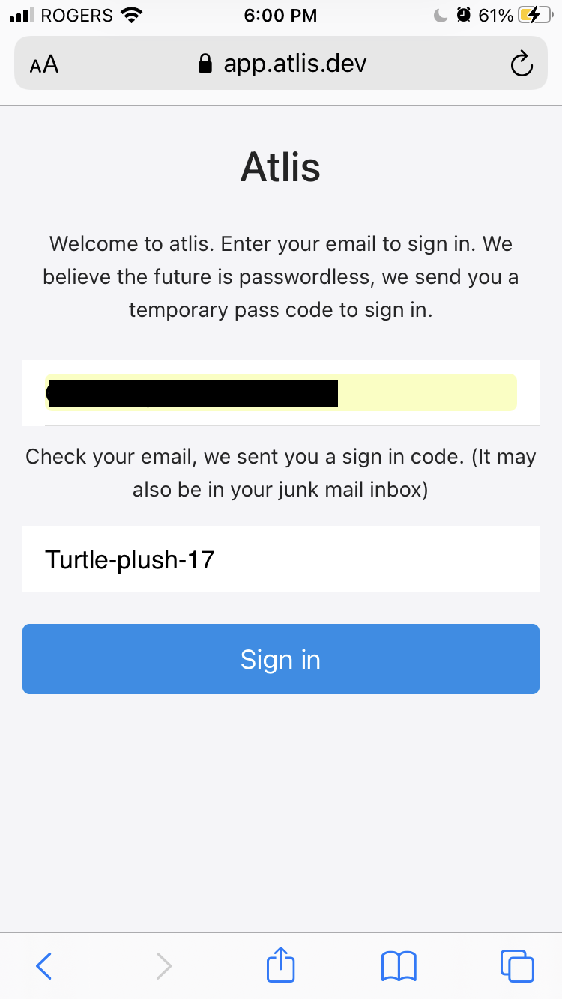

home tab
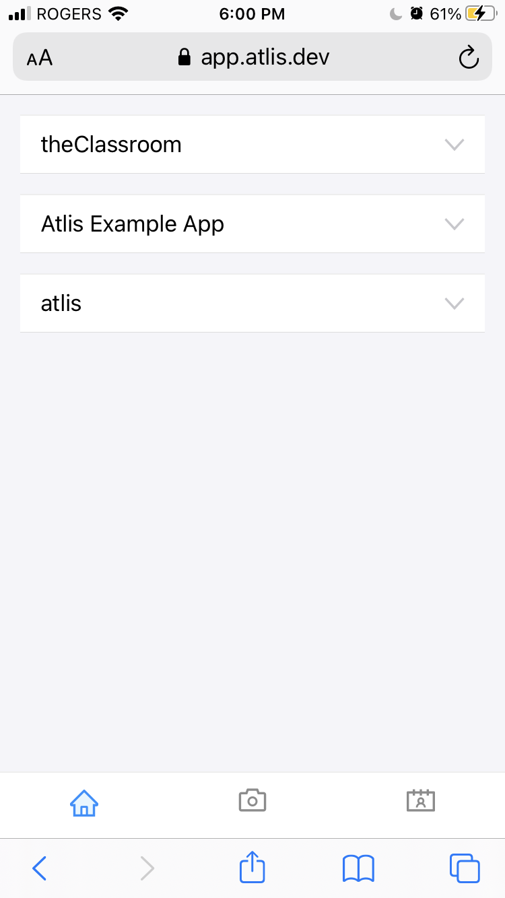

home dropdown info
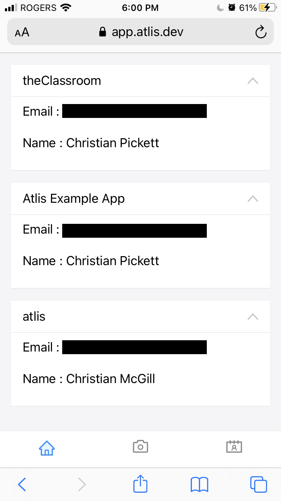

scan qr code tab
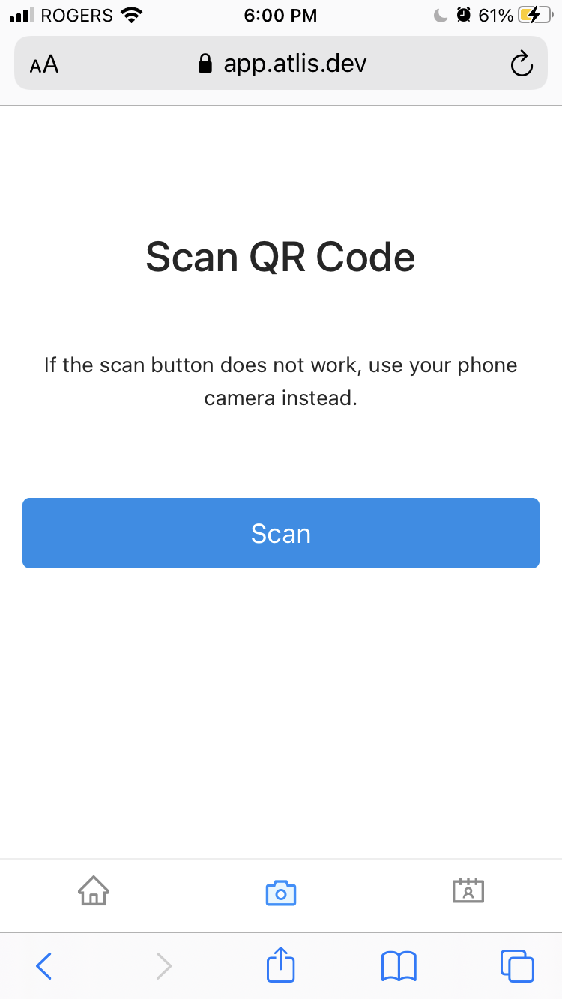

sign out tab
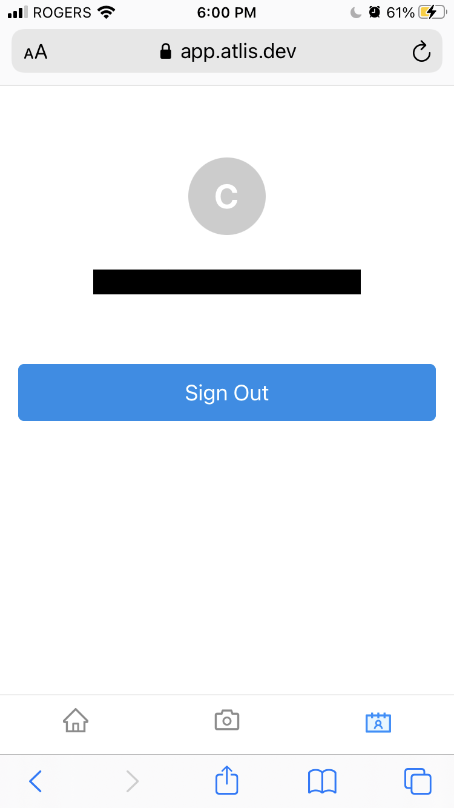

confirm sign in popup modal
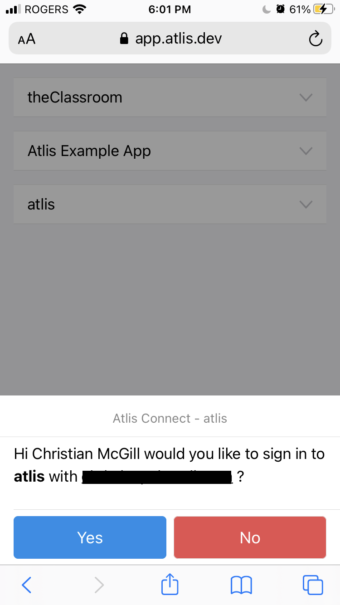

new sign in popup modal
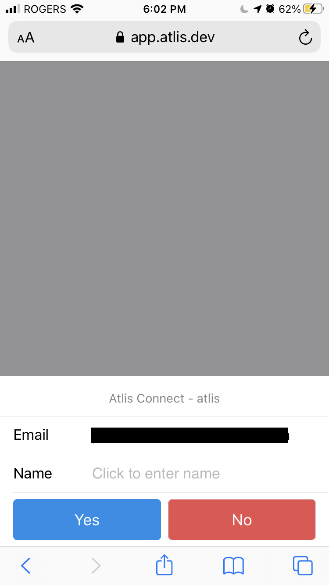

